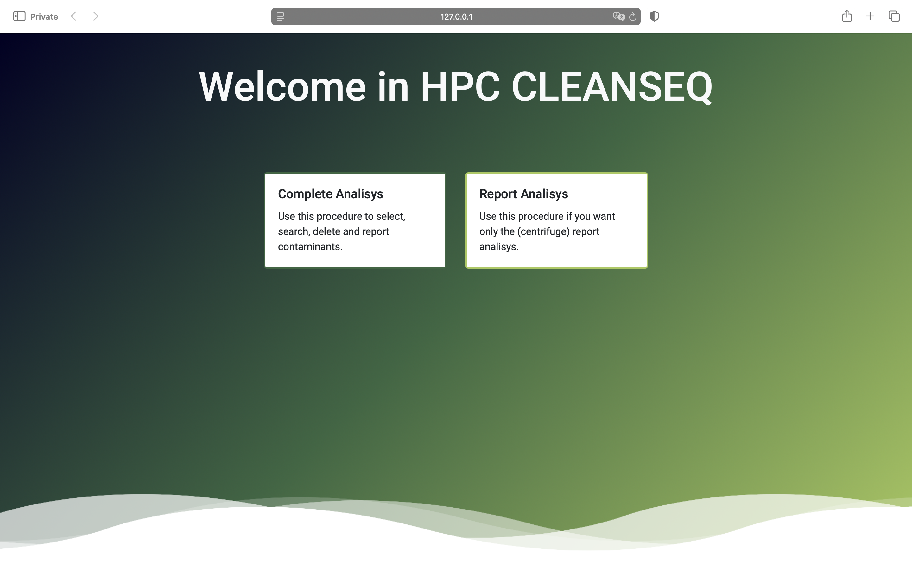
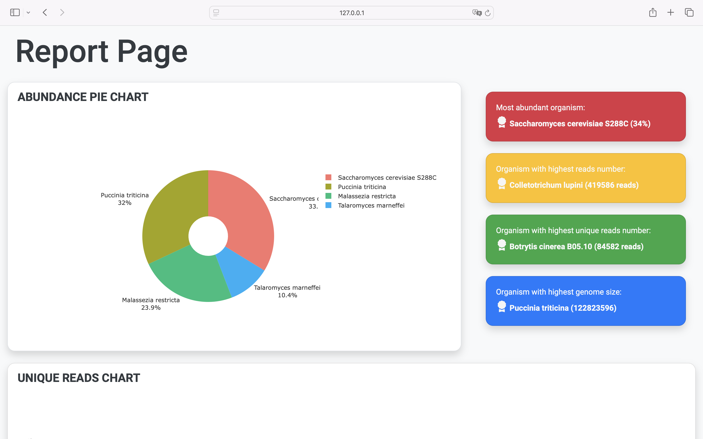
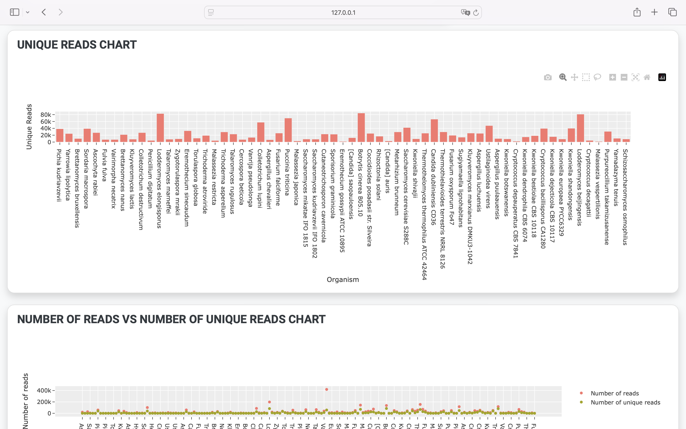
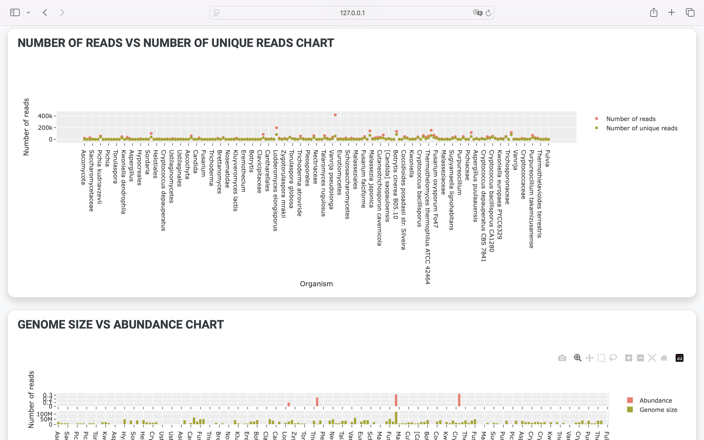
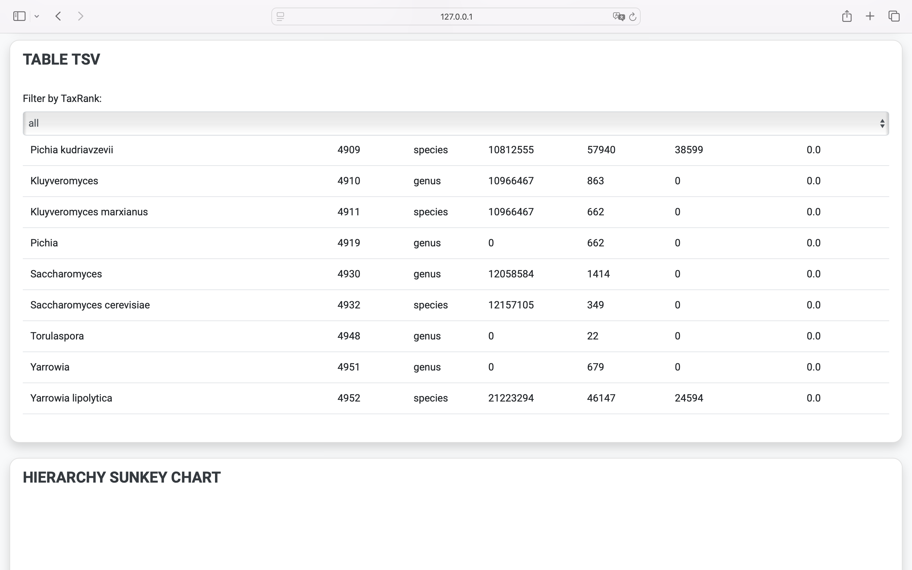
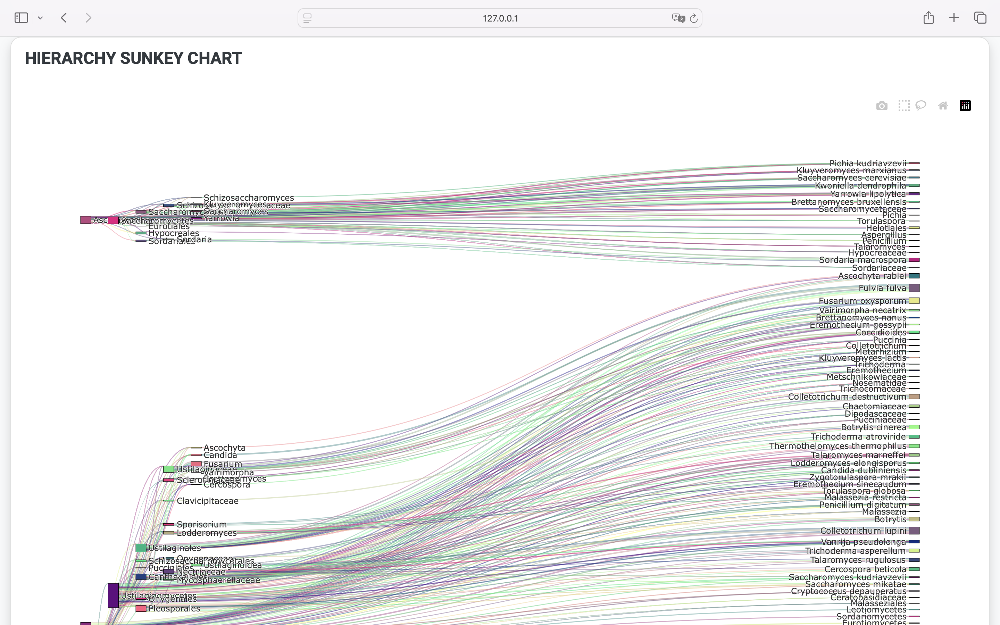

# HPC CLEANSEQ

## Index

1. [Description](#description)
2. [Installation](#installation)
3. [Startup](#startup)
4. [Usage](#usage)
5. [Contacts](#contacts)
6. [Credits](#credits)


## Description

HPC CLEANSEQ is software for searching for genetic sequences of foreign organisms within the sequencing of a biological sample.

HPC CLEANSEQ offers an interactive graphical interface for managing the entire biological sequence decontamination process, from authentication to the hpc cluster, to downloading “clean” sequences, i.e., without the sequences of the contaminants detected.

HPC CLEANSEQ can do the following operations:

1. Search for foreign organism requences inside input reads (both paired and single end) using Centrifuge.
2. Generate interactive charts and metrics about the report of the contaminants search.
3. Generate a special interactive pie chart using Recentrifuge, showing the presence of the organism in the input reads.
4. Clean the input reads from the contaminants organism sequences, using Rextract.

To better understand how it works in all its functionalities, one can refer to the following paper: [paper]()


## Installation

### Python 3 installation tutorial

To install python3 execute the following steps:

**WINDOWS**: 

1. Go to [python website](https://www.python.org) and download the latest version of python for Windows.
2. Install the downloaded file. In the main screen select Add Python to PATH, then Install Now.
3. Verify the installation: open the command prompt and type 
    
    ```bash
    python --version
    ```
    
    if all was successful the output of the command indicates the type of python version currently installed.

**MACOS**:

1. Go to [python website](https://www.python.org) and download the latest version of python for macOS.
2. Open the .pkg downloaded file and follow the steps to install python.
3. Verify the installation: open the terminal and type 

    ```bash
    python3 --version
    ```

    if all was successful the output of the command indicates the type of python version currently installed.

**LINUX**:

*Ubuntu/Debian*:

```bash
sudo apt update
sudo apt install python3
```

*Fedora*:

```bash
sudo dnf install python3
```

*Arch Linux*:
```bash
sudo pacman -S python
```

### Local PC side

To install HPC CLEANSEQ simply run the following commands:

```bash
git clone https://github.com/FGiannell/HPC_CleanSeq
cd HPC_CLEANSEQ
python install_requirements.py
```

This will install the software and all its dependencies.

Once this step is complete just run the application with the command:


### HPC Cluster side

copy and run the script called hpc_requirements.sh.

This is the content of the script

```bash
#!/bin/bash

echo "Downloading centrifuge ..."
cd $SCRATCH
git clone https://github.com/DaehwanKimLab/centrifuge
cd centrifuge
echo "Centrifuge downloaded."

echo "Compiling Centrifuge ..."
make
echo "Centrifuge compiled."

echo "Creating the python virtual environment for recentrifuge ..."
module load python/3.8.12--gcc--10.2.0
python3 -m venv recenv
source recenv/bin/activate
echo "Python environment created successfully."

echo "Installing Recentrifuge and Rextract in the python environment ..."
pip install recentrifuge xlrd 
echo "Recentrifuge and Rextract installed successfully."
```

Once you have finished installing the script, you can use HPC CLEANSEQ in all its functionality


## Startup

To start the software, once all the dependencies are installed, go to the HPC_CLEANSEQ folder and open a terminal there.
Type the following command to start the software:

```bash
python3 HPC_CleanSeq.py
```

And type the following url into your browser: 

```
127.0.0.1:3000
```


## Usage

When the software starts we have the main screen where we have two main choices:

1. Run the search for contaminants within the input readings, with the option to later run to view the interactive pie chart and clean sequences.
2. View metrics and graphs from a centrifuge report to be input to the software.




### 1° Option: Search for contaminants

If the first option is selected, a page is displayed where you can go to enter all the information regarding authentication to the hpc cluster, uploading the readings files (which can be either single or paired end, even compressed).

It is possible to go and choose the domains of the contaminant sequences that you want to detect within the input sequences.

Once the form is submitted, an authentication procedure is executed, uploading the sequences and running a Centrifuge script to detect the sequences.


Once this procedure is completed, the report page containing useful graphs and metrics is displayed, with the option of running a clean read and related download of the cleaned sequences, or generating an interactive pie chart generated by Recentrifuge.


### 2° Option: Visualize charts and metrics

If the second option is chosen, a screen appears in which we can upload a file (which must be in TSV format) to pull out metrics and graphs useful for understanding the output of the contaminant search performed by Centrifuge.


After uploading the file, the report's graphs and metrics screen appears.
This screen contains contains a pie chart representing the abundance of organisms selected as contaminants and that were detected within the input readings.

Also useful metrics such as:

* the organism with the largest genome size.
* the organism with the most reads found within the input reads.
* the organism with the most unique reads found within the input reads.
* the organism with the most abundant reads within the input reads.

There is also a graph comparing the genome size of various organisms with the relative abundance within the input reads.

A graph comparing the number of reads with the number of unique reads found for each organism within the input sequences.

A graph showing the hierarchy of contaminant organisms found within the input sequences.

A table is also shown to make the tsv file more readable for the user.







Note: Each graph is interactive and can be exported as an image in png format.


## Contacts

| Nome                          | Email                                                                                   |
|-------------------------------|-----------------------------------------------------------------------------------------|
| Prof. Liberati Franco         | [liberati@di.uniroma1.it](mailto:liberati@di.uniroma1.it)                               |
| Prof. Bottoni Paolo           | [bottoni@di.uniroma1.it](mailto:bottoni@di.uniroma1.it)                                 |
| Prof.ssa Castrignanò Tiziana  | [tiziana.castrignano@uniroma1.it](mailto:tiziana.castrignano@uniroma1.it)               |
| Giannelli Federico            | [giannelli.2081094@studenti.uniroma1.it](mailto:giannelli.2081094@studenti.uniroma1.it) |

*This project was developed with the support of the University of Roma "La Sapienza".*


## Credits

This software uses Centrifuge, Recentrifuge and Rextrac.

If you want to learn more about these software, please open the following pages:

* Centrifuge: [GitHub](https://github.com/DaehwanKimLab/centrifuge)
* Recentrifuge [GitHub](https://github.com/khyox/recentrifuge)
* Rextract [GitHub](https://github.com/khyox/recentrifuge)

